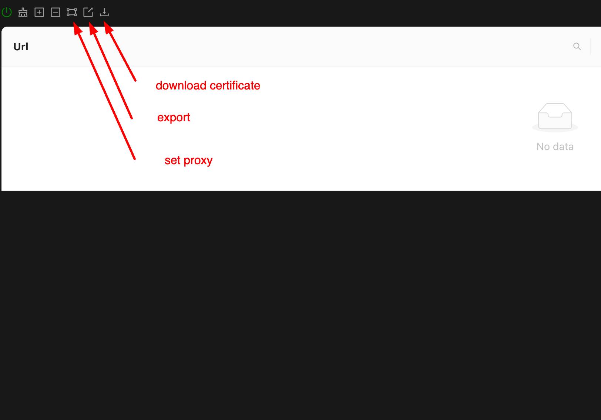
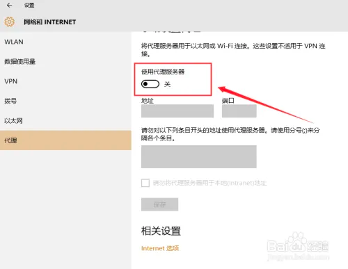
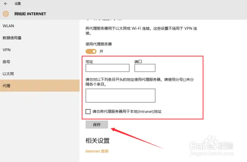
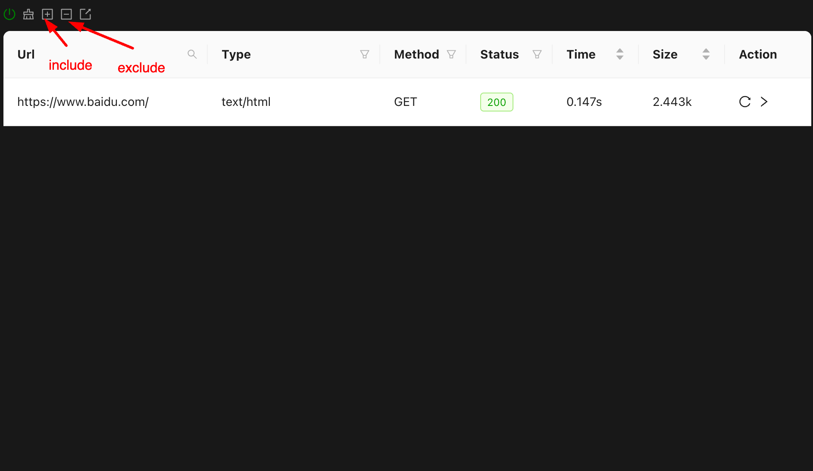
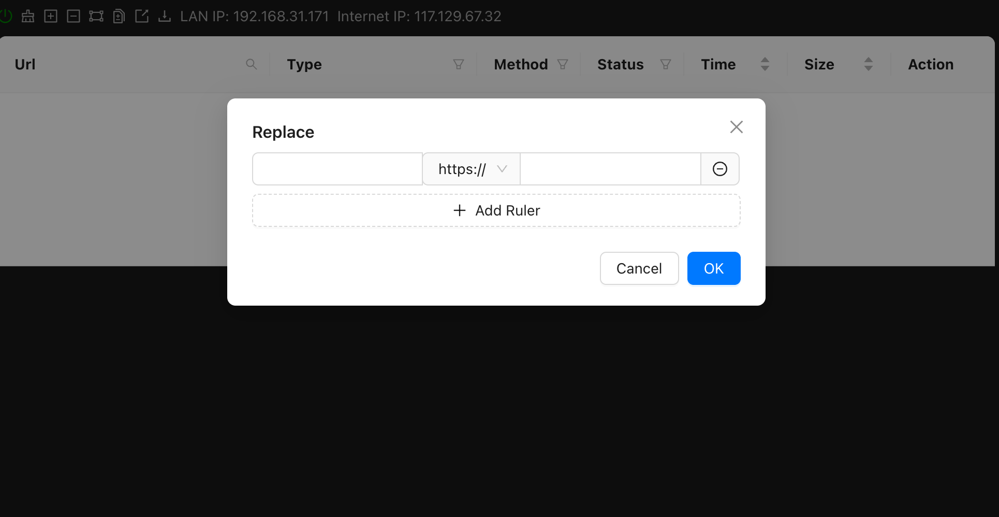

# go-mitm

中间人代理。可以方便地查看请求/响应，可以将响应替换成本地文件或远程地址，可以将请求转化成常用语言的请求代码。

[go-mitm](https://github.com/lizongying/go-mitm)

## Contents

1. [Feature](#Feature)
2. [Usage](#Usage)
    1. [Run](#Run)
    2. [Open the link](#Open-the-link)
    3. [Install certificate](#Install-certificate)
    4. [Set the proxy](#Set-the-proxy)
    5. [Include & Exclude](#Include--Exclude)
    6. [Replace](#Replace)
    7. [Tips](#Tips)
3. [Dev](#Dev)
4. [TODO](#TODO)

## Feature

* 支持启动/关闭中间人代理
* 支持设置包含/排除名单
* 支持设置上游代理
* 支持导出
* 支持清除/筛选/排序
* 支持请求转为各语言代码
* 支持响应以raw/html/json/hex等方式显示
* 支持请求重放

## Usage

### Run

下载相应平台的可执行文件并执行 [releases](https://github.com/lizongying/go-mitm/releases/)

如

```shell
./mitm_darwin_arm64

```

参数:

* -mid-port 指定中间人端口
* -web-port 指定网页端口
* -include 指定包含规则，多条规则用";"分割（使用中间人，页面能看到记录）
* -exclude 指定排除规则，多条规则用";"分割（使用直连，页面看不到记录）
* -proxy proxy 指定上游代理

过滤规则仅对hostname过滤。如

* a.com
* a.com.cn
* a.*.cn
* *.com
* a.*
* a.com.*
* \*.*

### Open the link

访问链接，如 http://localhost:8083


### Install certificate

当前设备下载安装并信任CA证书


mac:


windows:


### Set the proxy

设置代理为 http://localhost:8082

mac:


windows:




### Include & Exclude

按行进行分割，其他请参考`-include`和`-exclude`参数定义



### Replace

替换成指定网址（https://、http://），替换成本地文件（file://）



### Tips

* 如果设置了代理，直连的时候依然会使用代理。如果不需要代理，请清空代理。
* permission denied 解决办法:

```shell
chmod +x mitm_darwin_arm64
```

*

## Dev

### Test

```shell
go run ./cmd/mitm-web/*.go

# http://localhost:5173/
npm run --prefix ./web/ui dev

curl -X POST "https://httpbin.org/post" -H "accept: application/json" --data '{"a":"xyz","b":"123"}' -x http://localhost:8082 --cacert ./static/tls/ca.crt

curl "https://httpbin.org/get" -x http://192.168.31.171:8082 --cacert ./static/tls/ca.crt

```

### Build

```shell
make
```

## TODO

* python http.client
* node https/request
* java
* middleware tmpdir save image/video
* https proxy
* replace
