# go-mitm

中间人代理。可以更方便地查看请求/响应结果，可以将请求转化成常用语言的请求代码。

[go-mitm](https://github.com/lizongying/go-mitm)

## Contents

1. [Usage](#Usage)
    1. [Install certificate](#Install-certificate)
    2. [Set the proxy](#Set-the-proxy)
    3. [Run](#Run)
    4. [Open the link](#Open-the-link)
2. [Dev](#Dev)
3. [TODO](#TODO)

## Usage

### Install certificate

当前设备安装并信任CA证书 [ca.crt](https://github.com/lizongying/go-mitm/releases/download/v0.0.3/ca.crt)

mac:

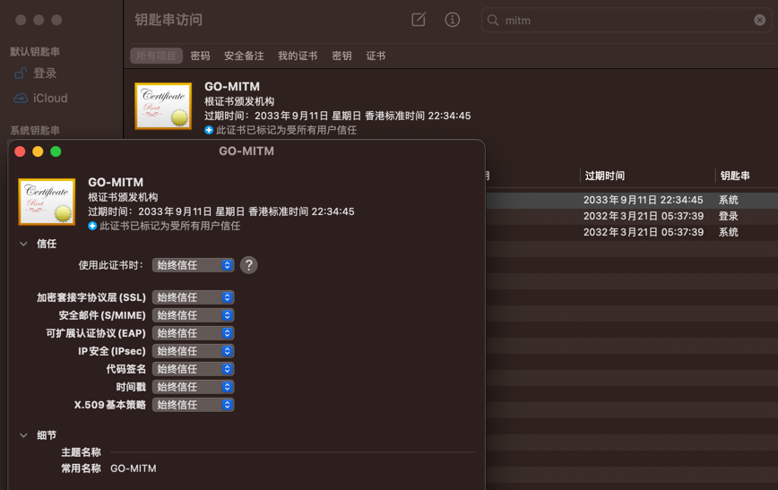

windows:

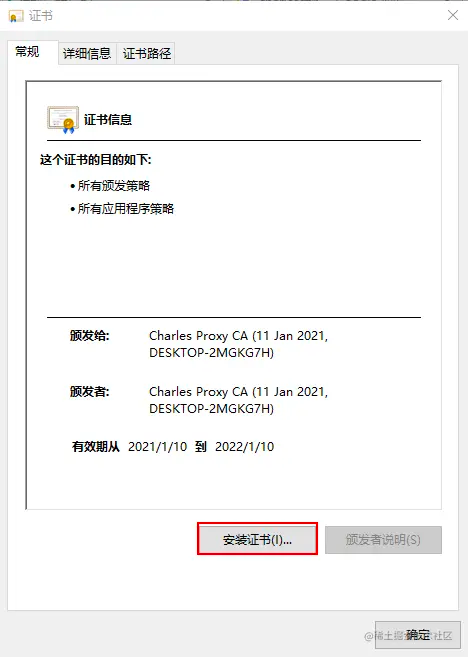
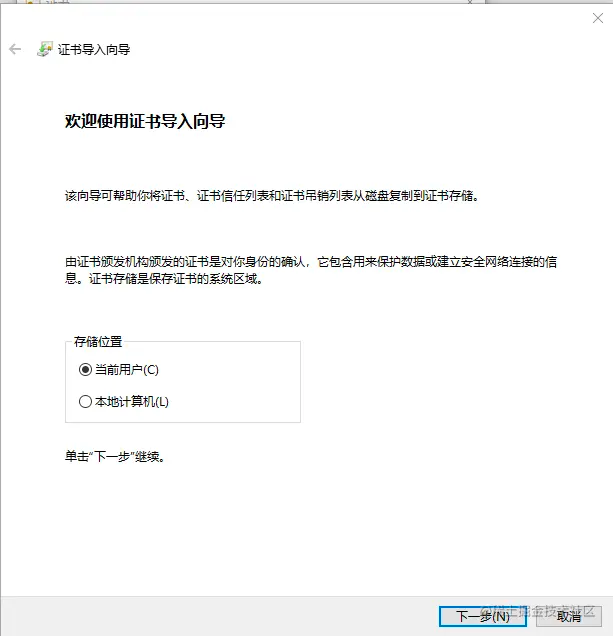
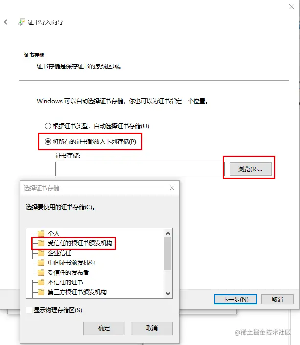
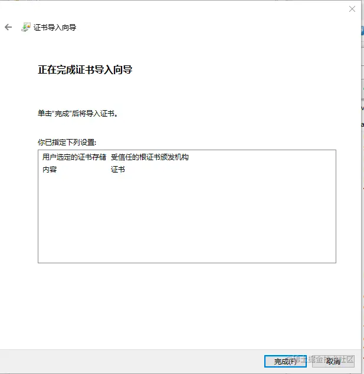

### Set the proxy

设置代理为 http://localhost:8082
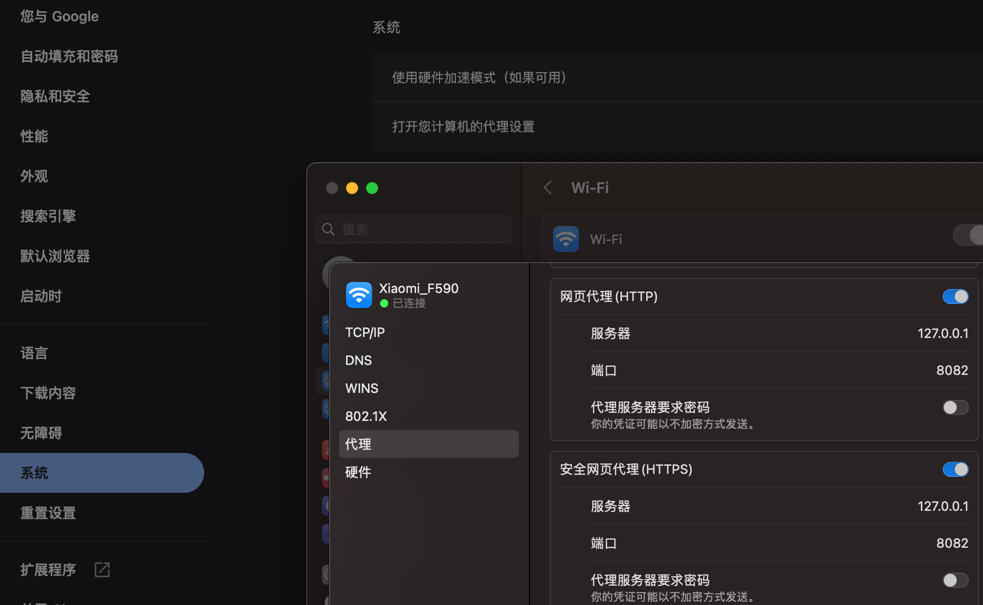

### Run

执行程序
mac: 

[mitm_darwin_arm64](https://github.com/lizongying/go-mitm/releases/download/v0.0.3/mitm_darwin_arm64) 
[mitm_darwin_amd64](https://github.com/lizongying/go-mitm/releases/download/v0.0.3/mitm_darwin_amd64)

linux: 

[mitm_linux_arm64](https://github.com/lizongying/go-mitm/releases/download/v0.0.3/mitm_linux_arm64) 
[mitm_linux_amd64](https://github.com/lizongying/go-mitm/releases/download/v0.0.3/mitm_linux_amd64)

windows:

[mitm_windows_amd64.exe](https://github.com/lizongying/go-mitm/releases/download/v0.0.3/mitm_windows_amd64.exe)

### Open the link

访问链接 http://localhost:8083

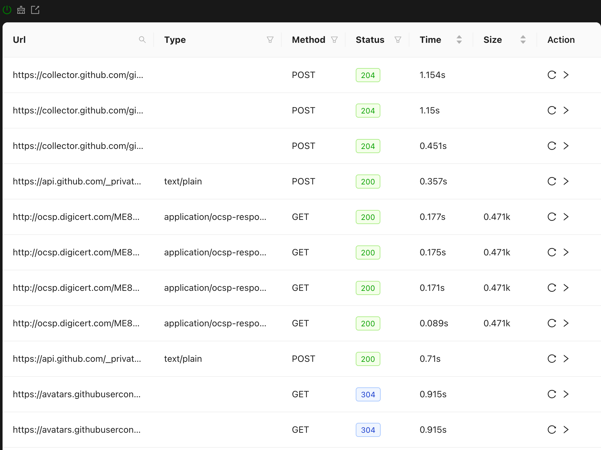
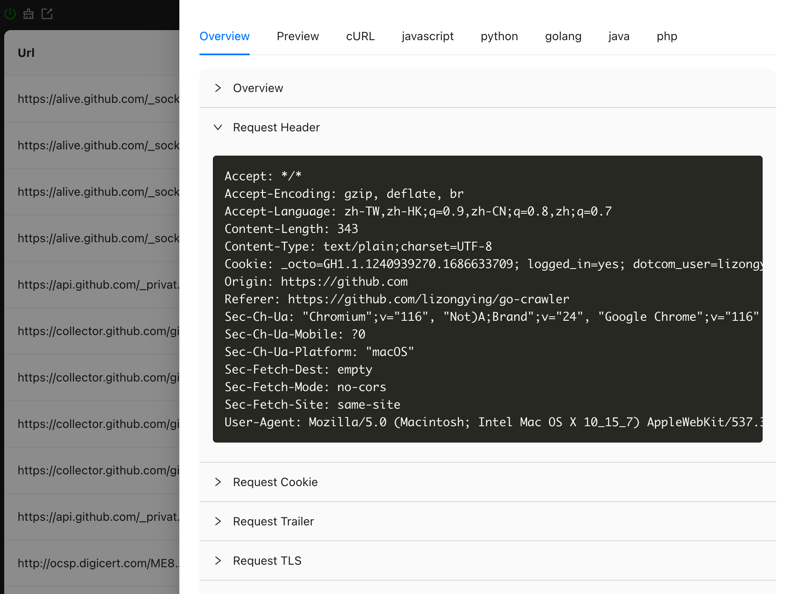
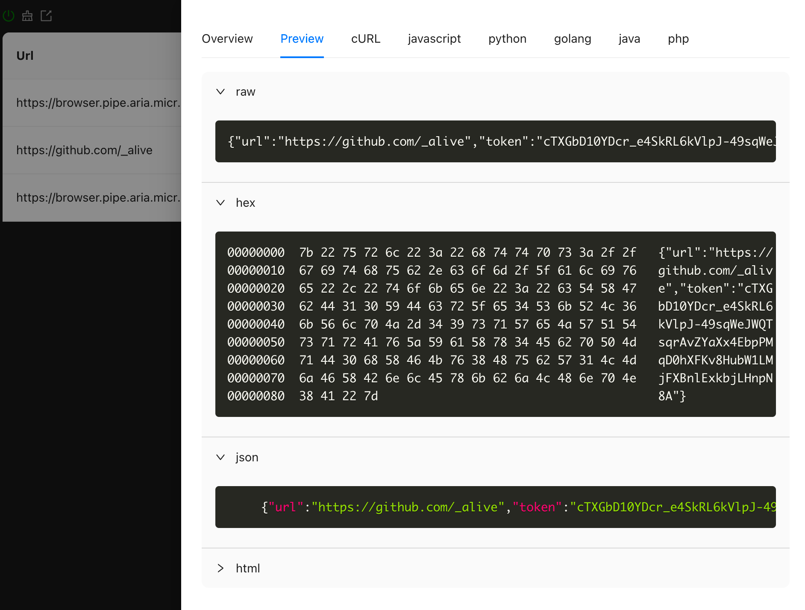
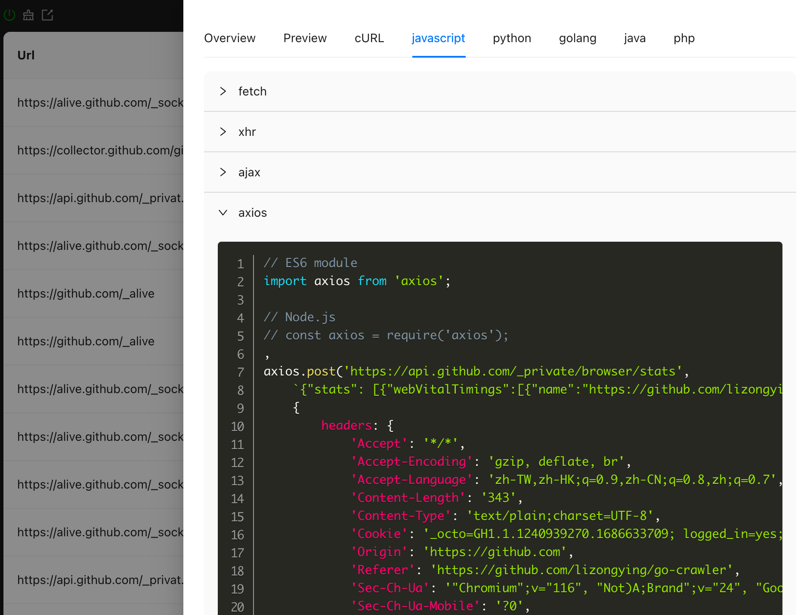
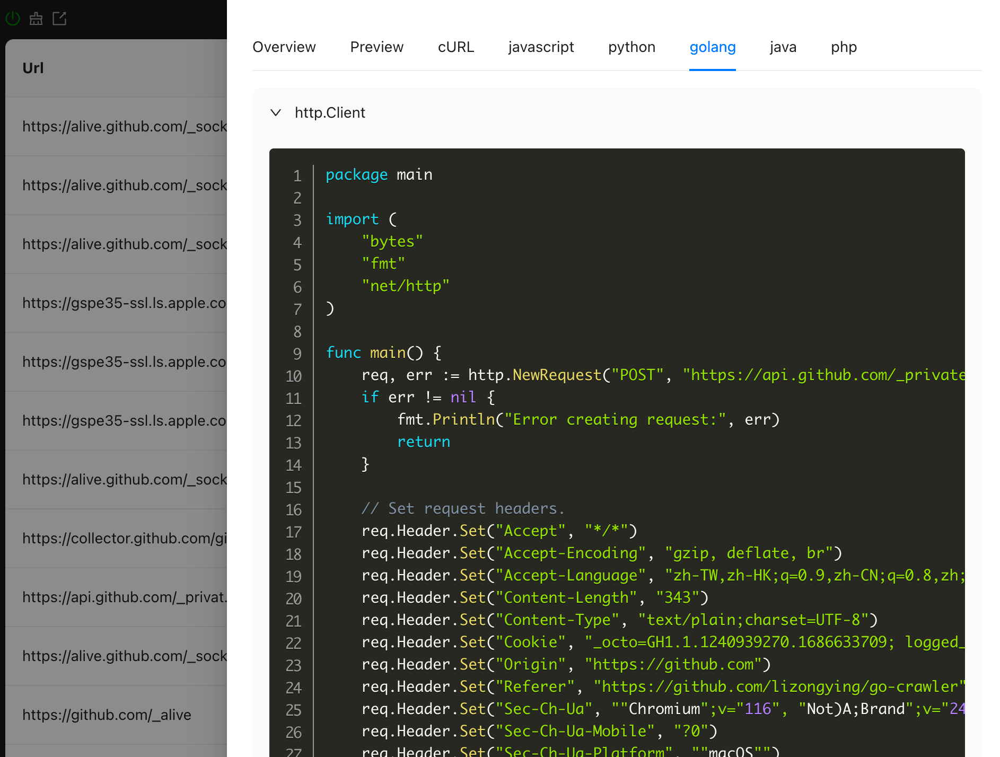

## Dev

### Test

```shell
go run ./cmd/mitm-web/*.go

# http://localhost:5173/
npm run --prefix ./web/ui dev

curl -X POST "https://httpbin.org/post" -H "accept: application/json" --data '{"a":"xyz","b":"123"}' -x http://localhost:8082 --cacert ./static/tls/ca.crt

```

### Build

```shell
make
```

## TODO

* python http.client
* node https/request
* java
* middleware tmpdir save image/video
